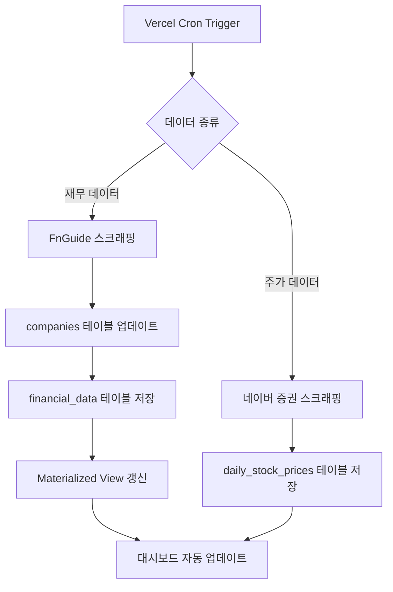

# 📊 YoonStock Pro - 데이터 수집 가이드

## 🎯 개요

YoonStock Pro는 **KOSPI 500개 + KOSDAQ 500개 = 총 1,000개** 기업의 재무 정보와 주가 정보를 자동으로 수집합니다.

### 수집 데이터

| 데이터 종류 | 수집 대상 | 데이터 소스 | 수집 주기 |
|------------|----------|------------|----------|
| **재무 데이터** | 1,000개 기업 x 4개년도 | FnGuide (컨센서스) | 매주 일요일 23:00 KST |
| **주가 데이터** | 1,000개 기업 x 당일 주가 | 네이버 증권 | 평일 20:00 KST |

---

## 🚀 시스템 구조

### 1. 재무 데이터 수집 (`/api/collect-data`)

**수집 프로세스**:
```
1. KOSPI 상위 500개 기업 목록 가져오기
2. KOSDAQ 상위 500개 기업 목록 가져오기
3. 각 기업별 FnGuide에서 최근 4개년도 재무 컨센서스 수집
   - 매출액 (revenue)
   - 영업이익 (operating_profit)
4. Supabase에 저장
   - companies 테이블: 기업 정보
   - financial_data 테이블: 재무 데이터
5. Materialized View 자동 갱신
```

**소요 시간**: 약 20-30분 (1,000개 기업 x 1초 딜레이)

**API 엔드포인트**: `https://dailystockdata.vercel.app/api/collect-data?secret=YOUR_CRON_SECRET`

### 2. 주가 데이터 수집 (`/api/collect-daily-prices`)

**수집 프로세스**:
```
1. Supabase에서 전체 기업 목록 조회 (~1,000개)
2. 네이버 증권에서 각 기업의 당일 주가 수집
   - 종가 (close_price)
   - 등락률 (change_rate)
   - 거래량 (volume)
3. 10개씩 병렬 처리로 빠른 수집
4. Supabase daily_stock_prices 테이블에 저장
```

**소요 시간**: 약 5-10분 (병렬 처리)

**API 엔드포인트**: `https://dailystockdata.vercel.app/api/collect-daily-prices?secret=YOUR_CRON_SECRET`

---

## 🔧 설정 방법

### 1단계: 환경 변수 확인

Vercel 대시보드에서 다음 환경 변수가 설정되어 있는지 확인하세요:

```bash
# Supabase 설정
NEXT_PUBLIC_SUPABASE_URL=https://your-project.supabase.co
NEXT_PUBLIC_SUPABASE_ANON_KEY=your-anon-key
SUPABASE_SERVICE_KEY=your-service-role-key  # 필수! 데이터 수집용

# Cron 보안
CRON_SECRET=your-random-secret-min-32-chars  # 필수! Cron Job 인증용

# 사이트 URL
NEXT_PUBLIC_SITE_URL=https://dailystockdata.vercel.app
```

**중요**: `CRON_SECRET`은 최소 32자 이상의 랜덤 문자열로 설정하세요.

### 2단계: Vercel Cron Jobs 설정

`vercel.json` 파일에 자동 수집 스케줄을 추가하세요:

```json
{
  "buildCommand": "next build",
  "framework": "nextjs",
  "crons": [
    {
      "path": "/api/collect-data",
      "schedule": "0 23 * * 0"
    },
    {
      "path": "/api/collect-daily-prices",
      "schedule": "0 20 * * 1-5"
    }
  ]
}
```

**스케줄 설명**:
- `0 23 * * 0`: 매주 일요일 23:00 UTC (한국시간 월요일 08:00)
- `0 20 * * 1-5`: 평일 월-금 20:00 UTC (한국시간 익일 05:00)

**시간대 주의**: Vercel Cron은 UTC 기준입니다!
- 한국시간(KST) = UTC + 9시간
- 한국시간 23:00 = UTC 14:00

### 3단계: 배포

```bash
git add vercel.json
git commit -m "feat: Add Vercel Cron Jobs for automated data collection"
git push origin main
```

Vercel이 자동으로 배포하고 Cron Jobs를 활성화합니다.

---

## 🎮 수동 실행 방법

### 방법 1: 브라우저에서 직접 실행

```
https://dailystockdata.vercel.app/api/collect-data?secret=YOUR_CRON_SECRET
https://dailystockdata.vercel.app/api/collect-daily-prices?secret=YOUR_CRON_SECRET
```

**주의**: 브라우저 탭을 닫지 마세요! (5-30분 소요)

### 방법 2: curl 명령어

```bash
# 재무 데이터 수집
curl "https://dailystockdata.vercel.app/api/collect-data?secret=YOUR_CRON_SECRET"

# 주가 데이터 수집
curl "https://dailystockdata.vercel.app/api/collect-daily-prices?secret=YOUR_CRON_SECRET"
```

### 방법 3: Postman / Thunder Client

```
GET https://dailystockdata.vercel.app/api/collect-data?secret=YOUR_CRON_SECRET
GET https://dailystockdata.vercel.app/api/collect-daily-prices?secret=YOUR_CRON_SECRET
```

---

## 📊 수집 현황 모니터링

### 실시간 모니터링 대시보드

https://dailystockdata.vercel.app/collection-status

**확인 가능한 정보**:
- 총 기업 수
- 재무 데이터 수집률 (4개년도 기준)
- 주가 데이터 수집률
- 최근 수집 날짜
- 전체 진행 상태

### Vercel 로그 확인

1. Vercel 대시보드 접속
2. 프로젝트 선택
3. "Logs" 탭 클릭
4. Cron Job 실행 로그 확인

---

## ⚙️ Cron 스케줄 커스터마이징

### Cron 표현식 이해하기

```
분 시 일 월 요일
*  *  *  *  *
```

**예시**:
```bash
# 매일 오전 9시 (UTC)
0 9 * * *

# 매주 월요일 오전 3시 (UTC)
0 3 * * 1

# 매월 1일 자정 (UTC)
0 0 1 * *

# 평일 오후 6시 (UTC)
0 18 * * 1-5

# 30분마다
*/30 * * * *
```

### 추천 스케줄 (한국시간 기준)

**재무 데이터 수집**:
```json
{
  "path": "/api/collect-data",
  "schedule": "0 14 * * 0"
}
```
- UTC 14:00 = 한국시간 일요일 23:00

**주가 데이터 수집**:
```json
{
  "path": "/api/collect-daily-prices",
  "schedule": "0 11 * * 1-5"
}
```
- UTC 11:00 = 한국시간 평일 20:00 (장 마감 후)

---

## 🚨 문제 해결

### 문제 1: Unauthorized (401) 에러

**원인**: `CRON_SECRET` 환경 변수가 설정되지 않았거나 틀림

**해결**:
1. Vercel 대시보드 → Settings → Environment Variables
2. `CRON_SECRET` 확인
3. URL에 올바른 secret 파라미터 사용

### 문제 2: Timeout 에러 (504)

**원인**: Vercel 무료 플랜은 10초, Pro 플랜은 5분 제한

**해결**:
- Vercel Pro 플랜 사용 (권장)
- 또는 데이터 수집을 여러 번으로 나누기

### 문제 3: 데이터 수집이 안 됨

**원인**: `SUPABASE_SERVICE_KEY` 미설정

**해결**:
1. Supabase 대시보드 → Settings → API
2. `service_role` secret 복사
3. Vercel 환경 변수에 `SUPABASE_SERVICE_KEY` 추가

### 문제 4: View 갱신 실패

**원인**: Materialized View가 존재하지 않음

**해결**:
1. Supabase SQL Editor에서 `scripts/schema-complete.sql` 실행
2. 또는 `scripts/schema-safe.sql` 실행

---

## 📈 성능 최적화 팁

### 1. 병렬 처리 조정

`app/api/collect-daily-prices/route.ts`:
```typescript
const BATCH_SIZE = 10; // 기본값
// 10 → 20으로 변경하면 2배 빨라지지만 안정성 감소
```

### 2. Rate Limiting 조정

`app/api/collect-data/route.ts`:
```typescript
await delay(1000); // 기본 1초
// 500으로 줄이면 2배 빨라지지만 차단 위험 증가
```

### 3. 배치 크기 조정

`app/api/collect-data/route.ts`:
```typescript
const BATCH_SIZE = 20; // 진행률 출력 간격
// 로그 출력 빈도 조절
```

---

## 🔄 데이터 업데이트 플로우



---

## 📝 체크리스트

### 초기 설정

- [ ] Supabase 프로젝트 생성
- [ ] 환경 변수 설정 (SUPABASE_URL, ANON_KEY, SERVICE_KEY)
- [ ] CRON_SECRET 생성 (32자 이상)
- [ ] 데이터베이스 스키마 실행 (schema-complete.sql)
- [ ] vercel.json에 Cron Jobs 추가
- [ ] Vercel 배포

### 첫 데이터 수집

- [ ] 수동으로 재무 데이터 수집 실행
- [ ] collection-status 페이지에서 확인
- [ ] 수동으로 주가 데이터 수집 실행
- [ ] 대시보드에서 데이터 확인

### 자동화 확인

- [ ] Vercel Cron Jobs 활성화 확인
- [ ] 다음 스케줄 실행 시간 확인
- [ ] 로그에서 자동 실행 확인

---

## 🆘 지원

문제가 발생하면 다음을 확인하세요:

1. **Vercel Logs**: 실시간 로그 확인
2. **Supabase Logs**: 데이터베이스 쿼리 로그
3. **Collection Status**: 수집 현황 대시보드
4. **GitHub Issues**: 버그 리포트 및 질문

---

## 🎉 완료!

이제 YoonStock Pro가 자동으로:
- ✅ 매주 일요일 23시에 1,000개 기업 재무 데이터 수집
- ✅ 평일 20시에 1,000개 기업 당일 주가 수집
- ✅ Materialized View 자동 갱신
- ✅ 대시보드 실시간 업데이트

**Happy Investing! 📈**
